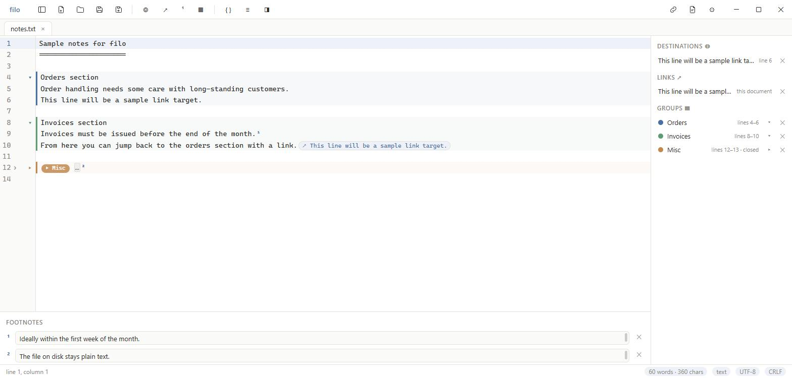
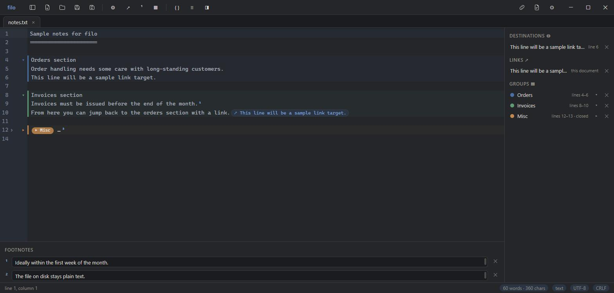

# filo

A minimal text editor for Windows, focused on editing rather than
formatting. The name is Italian for "thread" — the thread that ties lines
and pages together: you can mark a line as a target and create a link
somewhere else that jumps to it with a click, even from another file. On
top of that come footnotes and collapsible line groups.

The file on disk always stays plain text, openable with any editor. All
metadata (links, notes, groups) lives in the application's own store, one
JSON record per document in `%APPDATA%\io.github.aelfat.filo\meta`: no
companion files, no markers in the text. If a file is moved or renamed, its record
is matched back through a content fingerprint; if the text is changed by
another program, anchors are recovered from their surrounding context.
Anything that cannot be recovered shows up in the "Not found" section of
the panel — never silently lost.

## Features

- Links between lines and between files: Ctrl+L marks the current line as
  a target (again to unmark it), Ctrl+K creates a link at the cursor,
  clicking a link jumps to its target and opens the file if needed,
  Alt+Left goes back after a jump, right-click removes.
- Footnotes: Ctrl+N inserts a numbered superscript marker and opens the
  note in the bottom panel; navigation works both ways.
- Line groups: Ctrl+G on a selection, with a label, a color and a fold to
  hide the section; the open/closed state is persistent.
- Multi-document tabs (Ctrl+T, Ctrl+W, Ctrl+Tab), drag to reorder,
  Ctrl+Shift+T reopens the last closed tab. The session is restored on
  startup: open files, active tab, cursor position.
- Markdown with highlighting and preview (Ctrl+Shift+V).
- JSON and XML: live validation, format (Ctrl+Alt+F), minify
  (Ctrl+Alt+M); for JSON the status bar shows the path at the cursor,
  e.g. `orders[0].customer.name`. Syntax highlighting exists only for
  these formats — everything else is plain text, on purpose.
- File explorer sidebar (Ctrl+B) with favorite folders and a quick filter.
- UTF-8 and Windows-1252 with automatic detection, CRLF/LF line endings;
  both switchable with a click in the status bar.
- Atomic saves with rotating backups: the last ten copies of every file
  are kept in `%APPDATA%\io.github.aelfat.filo\backups`.
- Search and replace with regex and whole-word matching (Ctrl+F).
- Word and character count in the status bar, of the selection when one
  exists.
- Word wrap toggle (Alt+Z), text zoom (Ctrl+wheel, Ctrl+plus/minus/0),
  printing (Ctrl+P), recent files (right-click the Open button).
- If a file is changed by another program while open, filo notices and
  offers to reload it — re-anchoring the metadata afterwards.
- Sharing with metadata: "Export with metadata" (right-click a tab, or
  Ctrl+Shift+E) writes a single `.filo` file carrying the text together
  with its links, notes and groups; opening it in filo recreates the
  whole document as a new tab, ready to be saved wherever you want.
- Interface in English, Italian, German and French; light and dark theme;
  configurable font (Ctrl+comma).
- Errors are never silent: they show up in the status bar.

The `examples/` folder contains a few sample files to try links, notes
and the data tools.

## Development

You need Node.js and the Rust toolchain: filo is a Tauri 2 app with a
TypeScript frontend and no framework — plain DOM and CodeMirror 6.

    npm install
    npm run tauri dev      # run in development with hot reload
    npm test               # frontend tests: re-anchoring, hashing, paths
    cargo test --manifest-path src-tauri/Cargo.toml   # backend tests: encoding
    npm run tauri build    # NSIS installer in src-tauri/target/release/bundle

Good entry points for reading the code: `src/main.ts` (startup, shortcuts,
safe closing), `src/docs.ts` (multi-document handling and session),
`src/meta.ts` (anchors and re-anchoring, the heart of the project),
`src-tauri/src/lib.rs` (files, encoding, backups, metadata store, Windows
integration).

## Distribution

The NSIS installer installs per-user, without administrator rights, and
offers file associations for the common text formats. Alternatively the
single `src-tauri/target/release/filo.exe` works as a portable version:
copy it and run it.

The workflows in `.github/workflows/` run tests and builds on every push
(`ci.yml`) and create a Release with the installer on a `v1.x.y` tag
(`release.yml`).

## Author and license

Elfat Amiti — github.com/AElfat

If filo is useful to you, you can buy me a coffee: ko-fi.com/elfatamiti

Released under the MIT license.
